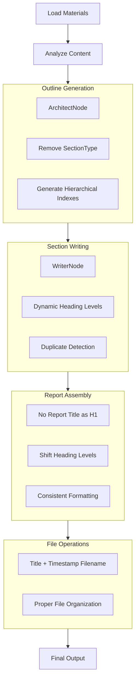

# Section Nesting Improvement Plan

## Overview
This plan addresses the limitations in the current section nesting implementation to support arbitrary heading levels and improve the overall report structure.

## Current Issues Identified

### 1. Hardcoded 3-Level Limit
- **Location**: `WriterNode` lines 388-394
- **Problem**: Uses hardcoded `##`, `###`, `####` based on section path length
- **Impact**: Prevents deeper nesting beyond 3 levels

### 2. Report Title Consumes H1
- **Location**: `Report.assemble()` lines 172 and 186
- **Problem**: Report title uses `#` heading, leaving only h2-h6 for actual content
- **Impact**: Wastes the most prominent heading level

### 3. Redundant SectionType Enum
- **Location**: `models.py` lines 9-13
- **Problem**: `CHAPTER`, `SECTION`, `SUBSECTION` are semantic labels only
- **Impact**: Causes confusion without enforcing actual structure

### 4. Potential Duplicate Headings
- **Problem**: LLM may generate headings, then code adds more
- **Impact**: Creates duplicate headings in final output

### 5. Inconsistent Heading Calculation
- **Problem**: Different components use different logic for heading levels
- **Impact**: Inconsistent output formatting

## Proposed Solution

### 1. Updated Section Model
```python
class Section(BaseModel):
    """Represents a hierarchical section in the report outline."""
    index: str = Field(..., description="Hierarchical index (e.g., '1', '1.1', '1.2.3')")
    title: str = Field(..., description="Title of the section")
    description: str = Field(..., description="Detailed instructions")
    content: Optional[str] = Field(None, description="Written content")
    subsections: List["Section"] = Field(default_factory=list)
    # REMOVED: type: SectionType
```

### 2. Heading Level Strategy
- **Report title**: Used only in filename, not as h1 in content
- **Top-level sections**: Use h1 (`#`)
- **Nested sections**: Calculate from dot count: `level = index.count('.') + 1`
- **Maximum level**: h6 (Markdown spec limit)
- **WriterNode**: Dynamic calculation instead of hardcoded limit

### 3. Filename Generation (No Changes Needed)
- Current implementation already correct: `{title_slug}_{timestamp_str}.md`
- Example: `machine_learning_report_20241231_012830.md`

### 4. ArchitectNode Prompt Updates
- Remove `type` field from JSON schema
- Add guidance: "Use 3 levels for typical reports, but support up to 6 levels if needed"
- Generate proper hierarchical indexes

### 5. Duplicate Heading Prevention
- Check if LLM response already starts with heading
- Use regex to detect existing headings
- Avoid adding duplicate headings

## Implementation Steps

### Step 1: Update Section Model
- Remove `SectionType` enum from `models.py`
- Update `Section` class to remove `type` field
- Update all imports and references

### Step 2: Update ArchitectNode Prompts
- Modify system prompt in `ArchitectNode.exec()` (lines 170-210)
- Remove `type` field from JSON schema
- Add guidance on heading levels

### Step 3: Fix WriterNode Heading Calculation
- Replace hardcoded logic (lines 388-394) with dynamic calculation
- Calculate heading level from index dot count
- Add duplicate heading detection

### Step 4: Update Report.assemble()
- Remove report title as h1 from output
- Shift all heading levels up by one
- Ensure consistent heading calculation

### Step 5: Test Deep Nesting
- Create test outline with 5-6 level nesting
- Verify heading levels are correct
- Ensure no duplicate headings

## Workflow Diagram



## Expected Benefits

1. **Arbitrary Nesting Support**: Up to 6 levels as per Markdown spec
2. **Better Heading Utilization**: Top-level sections get h1, not wasted on report title
3. **Simplified Model**: No redundant SectionType enum
4. **Consistent Formatting**: Uniform heading calculation across all components
5. **No Duplicate Headings**: Proper detection and prevention

## Testing Strategy

1. **Unit Tests**:
   - Test heading level calculation with various indexes
   - Test duplicate heading detection
   - Test report assembly without title as h1

2. **Integration Tests**:
   - Create outline with deep nesting (5-6 levels)
   - Run complete workflow
   - Verify final output formatting

3. **Backward Compatibility**:
   - Ensure existing reports still work
   - Test with legacy outline formats

## Files to Modify

1. `pocketreport/utils/models.py`
   - Remove `SectionType` enum
   - Update `Section` class

2. `pocketreport/nodes.py`
   - Update `ArchitectNode` prompts
   - Fix `WriterNode` heading logic
   - Update `AssembleReportNode`

3. `pocketreport/utils/save_report.py`
   - No changes needed (already correct)

4. `pocketreport/utils/outline_serializer.py`
   - Update for new Section model

## Migration Considerations

1. **Backward Compatibility**:
   - Keep `SectionType` enum but mark as deprecated
   - Add migration path for existing outlines
   - Provide conversion utility if needed

2. **Data Migration**:
   - Existing outlines with `type` field will need conversion
   - Can be done automatically during loading

## Success Criteria

1. ✅ Support arbitrary nesting up to 6 levels
2. ✅ Report title not used as h1 in content
3. ✅ No duplicate headings in final output
4. ✅ Consistent heading levels across all components
5. ✅ Backward compatibility maintained
6. ✅ All existing tests pass

## Next Steps

1. Review and approve this plan
2. Implement changes in Code mode
3. Test with various nesting scenarios
4. Update documentation
5. Deploy changes